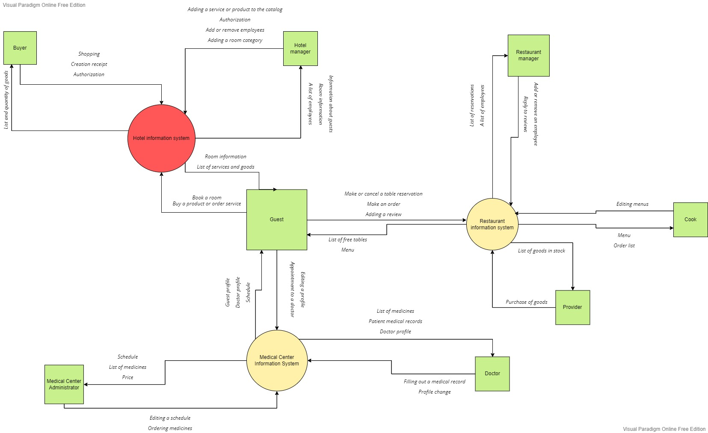
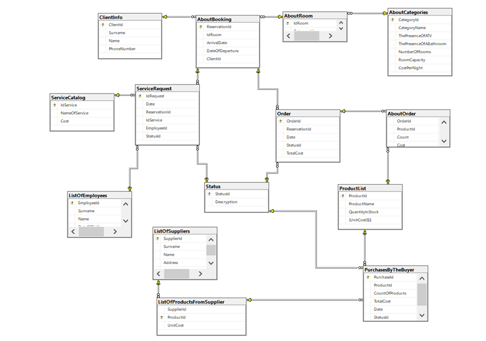
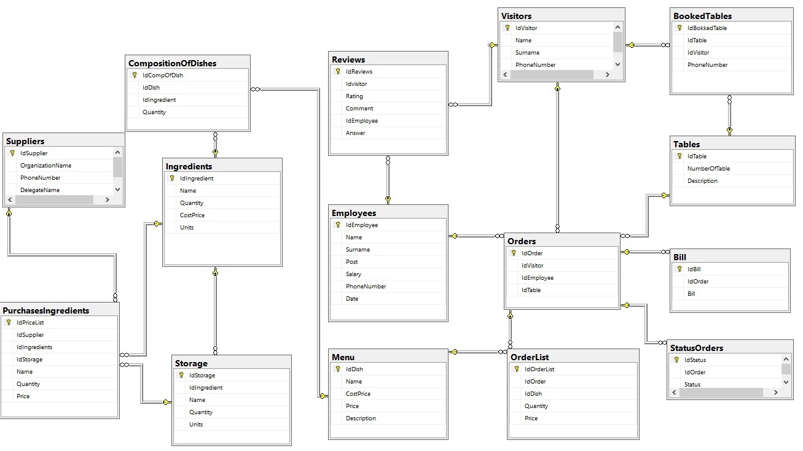

# software-construction-repo
## Проблема, которую решает проект
Проект должен автоматизировать процессы работы гостиницы. Среди отделов гостиницы должны быть реализованы медицинский центр и ресторан. Для обеспечения удобства взаимодействие с информационной системой гостиницы должно происходить посредством клиентского приложения. 

## Участники

- Фомина Полина 3530904/90101
- Казимиров Никита 3530904/90101
- Назаренко Алёна 3530904/90101

## Контекстная диаграмма

## Диаграмма контейнеров

## Диаграмма базы данных отеля

## Диаграмма базы данных медицинского центра

## Диаграмма базы данных ресторана

