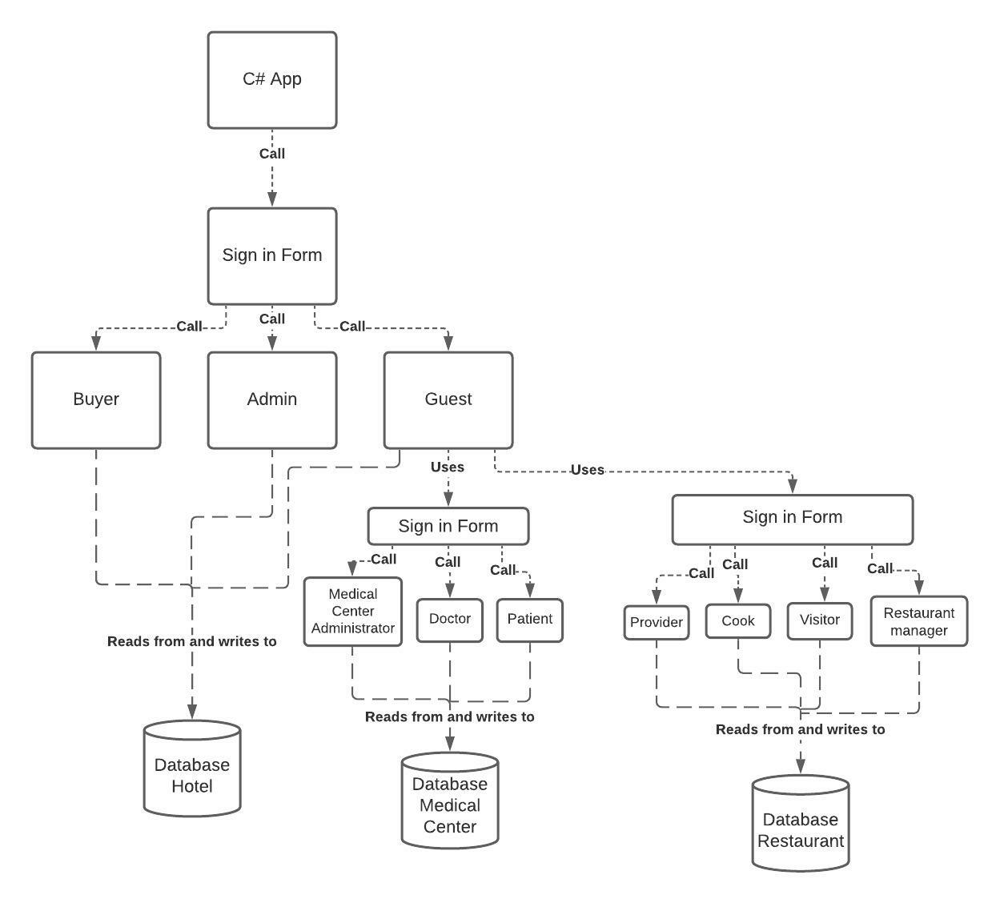
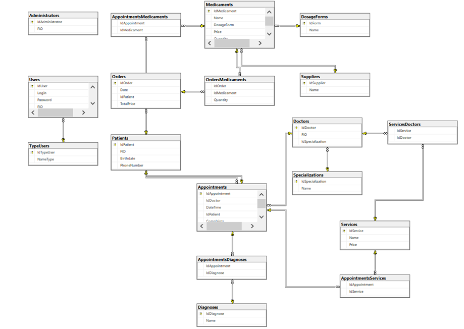
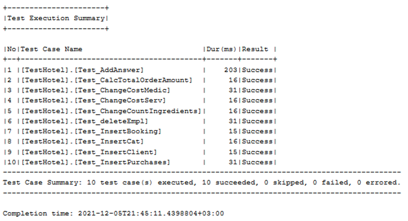

# software-construction-repo
## Проблема, которую решает проект
Проект должен автоматизировать процессы работы гостиницы. Среди отделов гостиницы должны быть реализованы медицинский центр и ресторан. Для обеспечения удобства взаимодействие с информационной системой гостиницы должно происходить посредством клиентского приложения. 

## Участники

- Фомина Полина 3530904/90101
- Казимиров Никита 3530904/90101
- Назаренко Алёна 3530904/90101

## Контекстная диаграмма

## Диаграмма контейнеров

## Диаграмма базы данных отеля

## Диаграмма базы данных медицинского центра

## Диаграмма базы данных ресторана

## Тестирование
В нашем проекте вся логика работы содержится в хранимых процедурах. С# приложение является просто визуальным интерфесом без бизнес-логики. Поэтому мы проводили тестирование именно хранимых процедур. Проводилось оно с помощью tSqlt — фреймворке unit-тестов для Sql Server. Результаты тестирования приведены на изображении ниже. 
- AddAnswer проверяет правильность добавления ответа на отзыв посетителя. В ответе может содержаться до 50 символов. Пустая строка(перенос строки или пробелы) за ответ не засчитывается. В процедуру передаются id отзыва и ответ администратора.
- CalcTotalOrderAmount проверяет вычисление итоговой стоимости заказа. В процедуру передаются количество и наименование товара.
- ChangeCostMedic тестирует изменение стоимости лекарства. Стоимость не может быть нулевой, а также отрицательной. В процедуру передаются наименование лекарства и его новая стоимость.
- ChangeCostServ тестирует изменение стоимости услуги. Стоимость не может быть нулевой, а также отрицательной. В процедуру передаются наименование услуги и её новая стоимость.
- ChangeCountIngredients тестирует изменение количества ингредиентов на складе. Количество может быть нулевым или положительным. В процедуру передаются наименование ингредиента и его количество.
- deleteEmpl проверяет корректность данных после удаления сотрудников. В заявках на услуги, сделанные до увольнения сотрудника, должен остаться его id. В процедуру передаются имя,фамилия и дата рождения сотрудника.
- InsertBooking проверяет корректность вставки нового бронирования. Должны правильно вставиться номер комнаты, дата въезда/выезда, а также id клиента. Дата должна быть в формате дд-мм-гг. Номер комнаты должен быть существующим.
- InsertCat проверяет правильность вставки новой категории. Они не должны повторяться в таблице, наименование категории не может состоять из цифр, а также быть пустым.
- InsertClient проверяет корректность добавления информации о новом клиенте. Имя и Фамилия состоят не более, чем из 50 символов. Номер должен состоять из 15 символов.
- InsertPurchases тестирует добавление чека от поставщика. При этом должна автоматически и правильно посчитаться итоговая сумма покупки, а также должно измениться количество товаров на складе. Id поставщика должно быть существующим.

